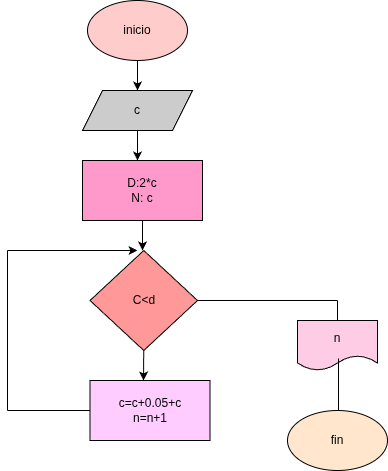

# interes_compuesto
un programa de phayton para obtener el capital 

## analisis 

### variable de entrada

- c = capital

### procedimiento
    while c < x 
    c = c * 1.05
    n = + 1

### variables de salida
- n
- c

## diseño

## construccion 
- codigo implementado en el archivo interes_compuesto.py